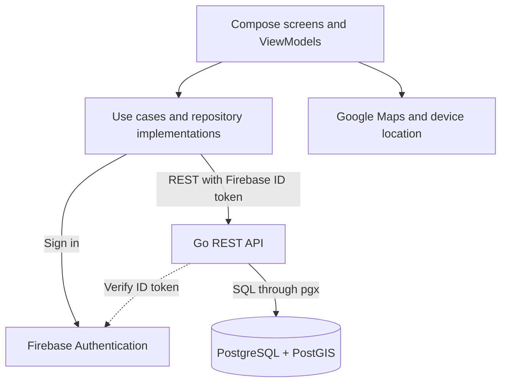

# Circle
**Small groups. Shared interests. Plans nearby.**

Circle is an Android app for creating and joining local activity groups of **4–8 people**. Find a coffee meetup, a run, or a board game night within your travel radius and connect through doing something together.

Built with **Kotlin, Jetpack Compose, Go, PostgreSQL, PostGIS, Firebase Authentication, and Google Maps**.

## Features

- **Nearby discovery:** Find upcoming circles within a configurable **1–10 km** radius, sorted by distance and filterable by activity. Started, completed, cancelled, and archived events stay out of Discover, including cached results.
- **Profiles and onboarding:** Set your interests, birthday, gender, location, and travel radius. Use foreground location access or choose a location through the map/search fallback.
- **Flexible circle creation:** Choose a default activity or create a custom category, set the time and group size, and select an inclusive age range and audience: everyone, male only, or female only.
- **Google Maps venues:** Pick a public meeting place on the map, confirm its name and address, and view its marker and directions from the circle details screen.
- **Membership and hosting:** Join or leave a circle, see available spots, and view attendees. When the host leaves, hosting transfers to the earliest remaining member. The circle is deleted only when its final member leaves.
- **Member-only chat:** Send messages through the Go REST API with foreground polling. Chat becomes read-only after the event ends or is cancelled.
- **Blocking:** Hide circles hosted or joined by a blocked user. Blocking also leaves shared circles; unblocking does not automatically rejoin them.
- **Offline support:** Browse saved feeds during network failures and recover creation drafts. Caches are isolated by account; creating, joining, leaving, and sending messages require a connection.
- **Material 3 appearance:** Choose Light, Dark, or System mode, with wallpaper-derived colors on supported Android devices.
  
The app also includes host editing/cancellation, an activity inbox, attendance feedback, profile statistics, and account deletion. Optional integrations add Gemini-assisted activity suggestions, pgvector recommendations based on past joins, and FCM push notifications.

# Demo Videos

<table align="center">
  <tr>
    <td align="center"><b>Demo 1</b></td>
    <td align="center"><b>Demo 2</b></td>
  </tr>
  <tr>
    <td align="center">
      <video src="https://github.com/user-attachments/assets/08437812-35f3-42b6-9a7e-0ec8af2acc4e" width="400" controls></video>
    </td>
    <td align="center">
      <video src="https://github.com/user-attachments/assets/5d341a07-ec45-4b20-8de4-209ff6932c28" width="400" controls></video>
    </td>
  </tr>
</table>

## Technology

| Layer | Technology |
| --- | --- |
| Android UI | Kotlin, Jetpack Compose, Material 3, Navigation Compose |
| App architecture | MVVM + Clean Architecture, coroutines, StateFlow |
| Backend | Go, standard-library `net/http`, JSON REST APIs |
| Persistence | PostgreSQL, `pgx`, SQL migrations |
| Location queries | PostGIS geography, `ST_DWithin`, GiST indexes |
| Authentication | Firebase email/password and Google sign-in |
| Maps and location | Google Maps SDK, Fused Location Provider, Android Geocoder |
| Local storage | DataStore preferences and session-isolated disk caching |
| Optional services | Gemini API, pgvector, Firebase Cloud Messaging |

## Architecture

The Android app uses one Gradle module with package-level boundaries. Compose screens render ViewModel state and dispatch user actions. Domain use cases depend on repository interfaces; data and platform implementations handle HTTP, authentication, caching, maps, and device services.

Firebase manages credentials. Go verifies Firebase ID tokens and maps authenticated users to PostgreSQL accounts. PostgreSQL stores profiles, saved locations, circles, memberships, venue coordinates, chat messages, blocks, and notification data. Passwords are handled by Firebase.
